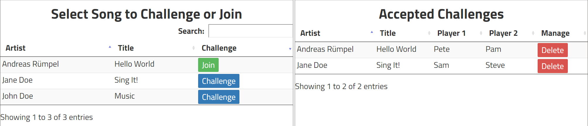

# About
Nucantus is a Web-based tool to organize challenges at your karaoke party. First, the party organizer distributes a participation link. Players may browse a song list and challenge a song by typing in their player name. Other players see open challenges and accept them by joining a song with their player name. An admin view lists all accepted challenges and tells you, which song to start next in your karaoke software.



## Create a Song List
First, a file with a list of song directories is required. The directory names must be newline-separated. Each directory's name must have the syntax `ARTIST - TITLE`. The file is created by navigating to your song directory and then executing one of the following shell scripts:

* Powershell: `Get-ChildItem -Name -Include "* - *" > songs.txt`
* GNU/bash: `ls -A1 | grep " - " > songs.txt`

Afterwards, copy the songs file to `src/main/resources/` of your project.

## Configure, Build and Run Server
The project comprises a RESTful Web service to store challenge data and static Web resources for user interaction. Challenges are held in-memory and thus do not outlast JVM termination. You need a song list, which can be generated from the song database of your karaoke software such as Vocaluxe.

* Build and runtime requirements: `jdk-17`
* The project comes with a Gradle wrapper, you do not need to have Gradle installed on you computer.

Configure Web service base URI for target hostname:

* `baseURI` at `src/main/resources/config.js` and
* `BASE_URI` at `src/main/java/de/nucantus/NucantusApplication.java` (optional, defaults to `http://0.0.0.0:5026/api/`)

Build the application and create the Java archive (JAR) with dependencies: `gradlew clean build`

Copy the created JAR from the `build/libs` directory of the project to your target host and run: `java -jar nucantus-all.jar`

You may also run the application using `gradlew run` directly.

## Challenge and Accept
The challenge view is available to your participants at `http://localhost:5026` or according to your URI configuration. The admin view displaying accepted challenges is available at `http://localhost:5026/admin.html`.

## Browse API
Run Swagger UI:
```
docker run -p 8080:8080 -e URL=http://localhost:5026/api/openapi.json --name swagger-ui swaggerapi/swagger-ui
```
